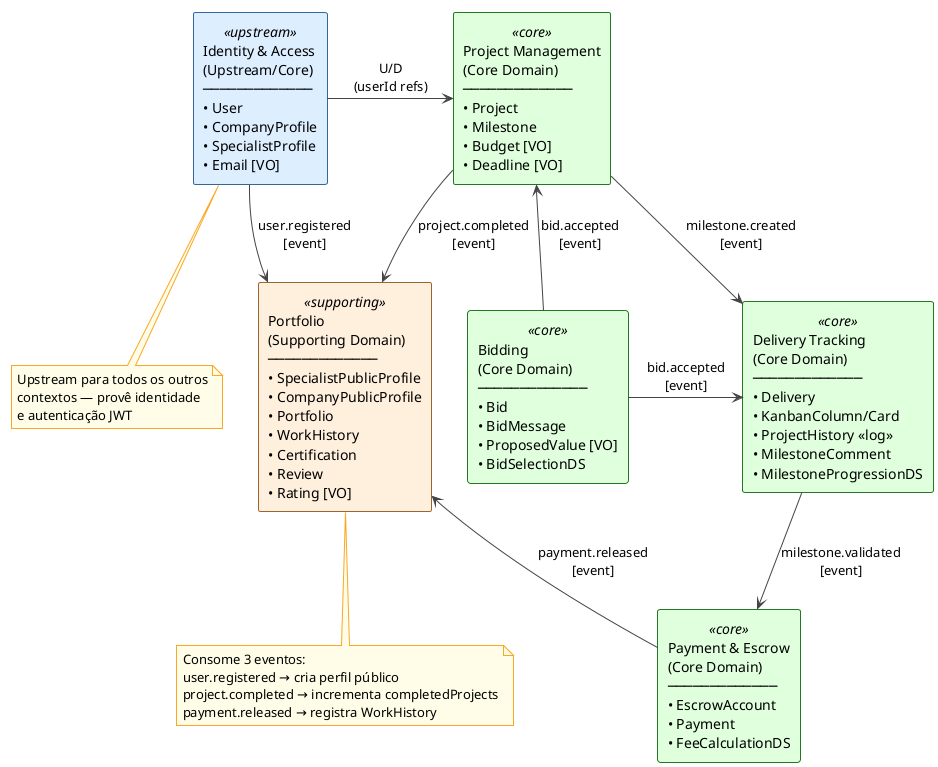
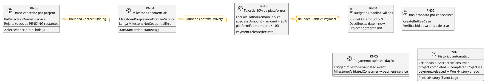
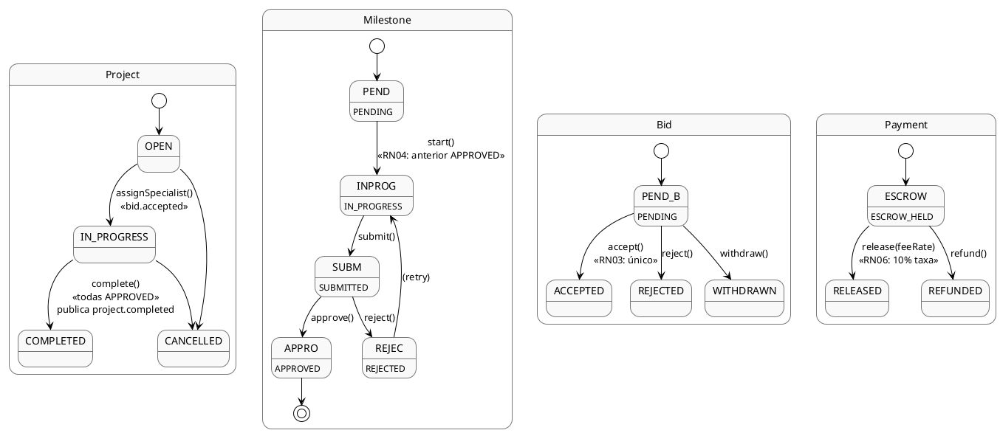

# Meraki — Modelagem DDD

> Domain-Driven Design aplicado à plataforma de contratação por projetos técnicos.
> Diagramas em PlantUML — renderize com extensão VS Code PlantUML (`Alt+D`) ou em plantuml.com.

---

## 1. Context Map (Mapa de Contextos)

---

## 2. Agregados por Bounded Context

```plantuml
@startuml Meraki_Aggregates
!theme plain
skinparam packageBackgroundColor #F8F8FF
skinparam packageBorderColor #8888CC
skinparam classBackgroundColor #FFFFFF
skinparam classBorderColor #999999
skinparam stereotypeCBackgroundColor #D0E8FF
skinparam stereotypeEBackgroundColor #FFE8C0
skinparam stereotypeSBackgroundColor #C0FFD0
skinparam stereotypeIBackgroundColor #FFD0E8

' ── IDENTITY ──
package "Identity & Access" {
  class User <<AggregateRoot>> {
    id: UUID
    email: Email «VO»
    userType: COMPANY | SPECIALIST
    specialistId?: UUID
    companyId?: UUID
  }
  class CompanyProfile <<Entity>> {
    companyName, industry, website
  }
  class SpecialistProfile <<Entity>> {
    skills[], experience, hourlyRate, rating
  }
  User *-- CompanyProfile
  User *-- SpecialistProfile
}

' ── PROJECT ──
package "Project Management" {
  class Project <<AggregateRoot>> {
    id: UUID
    budget: Budget «VO»
    deadline: Deadline «VO»
    status: OPEN|IN_PROGRESS|COMPLETED|CANCELLED
    + assignSpecialist()
    + complete()   ← publica project.completed
    + cancel()
  }
  class Milestone <<Entity>> {
    order: int
    status: PENDING|IN_PROGRESS|SUBMITTED|APPROVED|REJECTED
    + start(allMilestones[]) «RN04»
    + submit() / approve() / reject()
  }
  Project *-- Milestone
}

' ── BIDDING ──
package "Bidding" {
  class Bid <<AggregateRoot>> {
    proposedBudget: ProposedValue «VO»
    status: PENDING|ACCEPTED|REJECTED|WITHDRAWN
    + accept() / reject() / withdraw()
  }
  class BidMessage <<Entity>> {
    senderId, message
    ' Negociação entre empresa e especialista
  }
  class BidSelectionDomainService <<DomainService>> {
    + selectWinner(bidId, bids[]) «RN03»
  }
  Bid *-- BidMessage
  BidSelectionDomainService ..> Bid
}

' ── DELIVERY ──
package "Delivery Tracking" {
  class Delivery <<AggregateRoot>> {
    status: PENDING|SUBMITTED|APPROVED|REJECTED
    deliveredFiles[], rejectionReason?
  }
  class KanbanColumn <<AggregateRoot>> {
    title, order
  }
  class KanbanCard <<Entity>> {
    milestoneId, order, milestoneStatus?
  }
  class ProjectHistory <<EventLog>> {
    action, description «RN07»
    ' Read Model — sem invariantes de domínio
  }
  class MilestoneComment <<Entity>> {
    userId, comment
    ' Comentários de feedback entre empresa e especialista
  }
  class MilestoneProgressionDomainService <<DomainService>> {
    + canStart(order, statuses[]) «RN04»
  }
  KanbanColumn *-- KanbanCard
  MilestoneProgressionDomainService ..> Delivery
}

' ── PAYMENT ──
package "Payment & Escrow" {
  class EscrowAccount <<AggregateRoot>> {
    totalAmount, heldAmount, releasedAmount
  }
  class Payment <<AggregateRoot>> {
    amount, specialistAmount, platformFee
    status: ESCROW_HELD|RELEASED|REFUNDED
    + release(feeRate) «RN06»
  }
  class FeeCalculationDomainService <<DomainService>> {
    rate: 10%
    + calculate(amount): FeeResult «RN06»
  }
  FeeCalculationDomainService ..> Payment
}

' ── PORTFOLIO ──
package "Portfolio" {
  class SpecialistPublicProfile <<AggregateRoot>> {
    rating: Rating «VO»
    totalProjects, completedProjects
    ' completedProjects incrementado via project.completed
  }
  class CompanyPublicProfile <<AggregateRoot>> {
    rating: Rating «VO»
    totalProjectsCreated
  }
  class Portfolio <<AggregateRoot>> {
    title, technologies[], isPublished
  }
  class WorkHistory <<AggregateRoot>> {
    amountEarned, completedAt «RF11,RF14»
  }
  class Review <<AggregateRoot>> {
    rating: Rating «VO»
    comment?
  }
  class Certification <<AggregateRoot>> {
    name, issuer, credentialUrl?
  }
}

@enduml
```

---

## 3. Value Objects e Invariantes

```plantuml
@startuml Meraki_ValueObjects
!theme plain
skinparam classBackgroundColor #FFFDE7
skinparam classBorderColor #F9A825
skinparam stereotypeCBackgroundColor #FFF3CD

class Email <<ValueObject>> {
  - value: string
  ..invariante..
  formato RFC válido
  ..métodos..
  + isValid(): boolean
  + equals(other): boolean
  + getValue(): string
}

class Budget <<ValueObject>> {
  - amount: Decimal
  ..invariante..
  amount > 0 [RN01]
  ..métodos..
  + getValue(): Decimal
  + equals(other): boolean
}

class Deadline <<ValueObject>> {
  - date: Date
  ..invariante..
  date > now [RN01]
  ..métodos..
  + getValue(): Date
  + isBefore(date): boolean
  + equals(other): boolean
}

class ProposedValue <<ValueObject>> {
  - amount: Decimal
  ..invariante..
  amount > 0
  ..métodos..
  + getValue(): Decimal
  + equals(other): boolean
}

class Rating <<ValueObject>> {
  - value: Decimal
  ..invariante..
  0 ≤ value ≤ 5
  ..métodos..
  + getValue(): Decimal
  + equals(other): boolean
  + {static} average(ratings[]): Rating
}

note right of Email : Usado em: Identity
note right of Budget : Usado em: Project
note right of Deadline : Usado em: Project
note right of ProposedValue : Usado em: Bidding
note right of Rating : Usado em: Portfolio\n(Specialist, Company, Review)

@enduml
```

---

## 4. Fluxo de Eventos de Domínio

```plantuml
@startuml Meraki_DomainEvents
!theme plain

skinparam rectangle {
  BackgroundColor<<command>>  #BBDEFB
  BackgroundColor<<event>>    #FFE082
  BackgroundColor<<policy>>   #E1BEE7
  BackgroundColor<<readmodel>> #C8E6C9
  BorderColor<<command>>  #1976D2
  BorderColor<<event>>    #F9A825
  BorderColor<<policy>>   #7B1FA2
  BorderColor<<readmodel>> #388E3C
}

' Row 1 - Registro
rectangle "Registrar\nUsuário" <<command>> as C1
rectangle "user.registered" <<event>> as E1
rectangle "Criar Perfil\nPúblico" <<policy>> as P1
rectangle "Specialist/Company\nPublicProfile" <<readmodel>> as R1

C1 -right-> E1
E1 -right-> P1 : portfolio-service
P1 -right-> R1

' Row 2 - Projeto + Milestone
rectangle "Criar\nMilestone" <<command>> as C3
rectangle "milestone.created" <<event>> as E3
rectangle "Criar\nKanban Card" <<policy>> as P3
rectangle "KanbanCard\n(col. Pendente)" <<readmodel>> as R3

C3 -right-> E3
E3 -right-> P3 : delivery-service
P3 -right-> R3

' Row 3 - Bidding
rectangle "Selecionar\nVencedor" <<command>> as C4
rectangle "bid.accepted" <<event>> as E4
rectangle "Assign\nSpecialist\n[project-svc]" <<policy>> as P4a
rectangle "Init Kanban\nBoard\n[delivery-svc]" <<policy>> as P4b

C4 -right-> E4
E4 -down-> P4a
E4 -right-> P4b

' Row 4 - Validação de Milestone
rectangle "Aprovar\nEntrega" <<command>> as C5
rectangle "milestone.validated" <<event>> as E5
rectangle "Liberar\nPagamento\n[RN05, RN06]" <<policy>> as P5
rectangle "payment.released" <<event>> as E6
rectangle "Registrar\nWorkHistory\n[RF11, RN07]" <<policy>> as P6
rectangle "WorkHistory\ncriado" <<readmodel>> as R6

C5 -right-> E5
E5 -right-> P5 : payment-service
P5 -right-> E6
E6 -right-> P6 : portfolio-service
P6 -right-> R6

' Row 5 - Conclusão de Projeto
rectangle "Concluir\nProjeto\n[todas APPROVED]" <<command>> as C7
rectangle "project.completed" <<event>> as E7
rectangle "Incrementar\ncompletedProjects\n[portfolio-svc]" <<policy>> as P7
rectangle "SpecialistProfile\natualizado" <<readmodel>> as R7

C7 -right-> E7
E7 -right-> P7 : portfolio-service
P7 -right-> R7

@enduml
```

---

## 5. Regras de Negócio — Localização no Domínio

---

## 6. Máquinas de Estado

---

## 7. Resumo — Value Objects, Domain Services e Factories

| Tipo | Nome | Bounded Context | Responsabilidade |
|---|---|---|---|
| **VO** | `Email` | Identity | Validação de formato RFC |
| **VO** | `Budget` | Project | amount > 0 (RN01) |
| **VO** | `Deadline` | Project | data futura (RN01) |
| **VO** | `ProposedValue` | Bidding | amount > 0 |
| **VO** | `Rating` | Portfolio | 0 ≤ value ≤ 5 |
| **DS** | `BidSelectionDomainService` | Bidding | Único vencedor por projeto (RN03) |
| **DS** | `MilestoneProgressionDomainService` | Delivery | Progressão sequencial (RN04) |
| **DS** | `FeeCalculationDomainService` | Payment | Taxa 10% da plataforma (RN06) |
| **Factory** | `KanbanColumnFactory` | Delivery | Colunas padrão do board |
| **Factory** | `SpecialistProfileFactory` | Portfolio | Perfil público de especialista |

---

## 8. Erros de Domínio

| Classe | Contexto | Quando lançado |
|---|---|---|
| `MilestoneNotSequentialError` | Delivery | Milestone iniciada fora de ordem (RN04) |
| `BidAlreadyAcceptedError` | Bidding | Segunda bid aceita no mesmo projeto (RN03) |
| `InvalidBudgetError` | Project | Budget ≤ 0 (RN01) |
| `InvalidDeadlineError` | Project | Deadline no passado (RN01) |
| `InvalidRatingError` | Portfolio | Rating fora de [0, 5] |
| `PaymentNotInEscrowError` | Payment | Pagamento em status inválido para release |

---

## 9. Tabela de Eventos — Estado Final

| Evento | Publicado por | Consumido por | Efeito |
|---|---|---|---|
| `user.registered` | identity-service | portfolio-service | Cria SpecialistPublicProfile ou CompanyPublicProfile |
| `project.created` | project-service | — | (futuro: notificações) |
| `milestone.created` | project-service | delivery-service | Cria KanbanCard na coluna "Pendente" |
| `milestone.updated` | project-service | — | (futuro: notificações) |
| `bid.submitted` | bidding-service | — | (futuro: notificações) |
| `bid.accepted` | bidding-service | project-service | Chama `Project.assignSpecialist()` |
| `bid.accepted` | bidding-service | delivery-service | Cria KanbanBoard + registra ProjectHistory |
| `milestone.validated` | delivery-service | payment-service | Libera pagamento com taxa (RN05, RN06) |
| `payment.released` | payment-service | portfolio-service | Cria WorkHistory (RF11, RF14) |
| `project.completed` | project-service | portfolio-service | Incrementa `completedProjects` no perfil |
| `delivery.submitted` | delivery-service | — | (futuro: notificações) |
