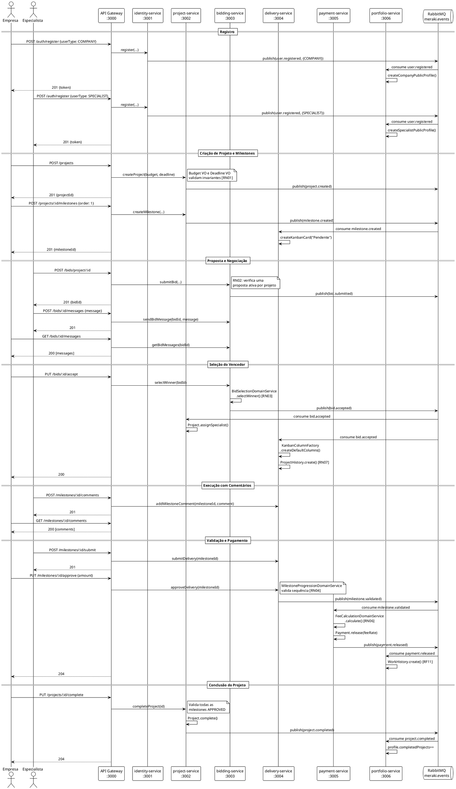
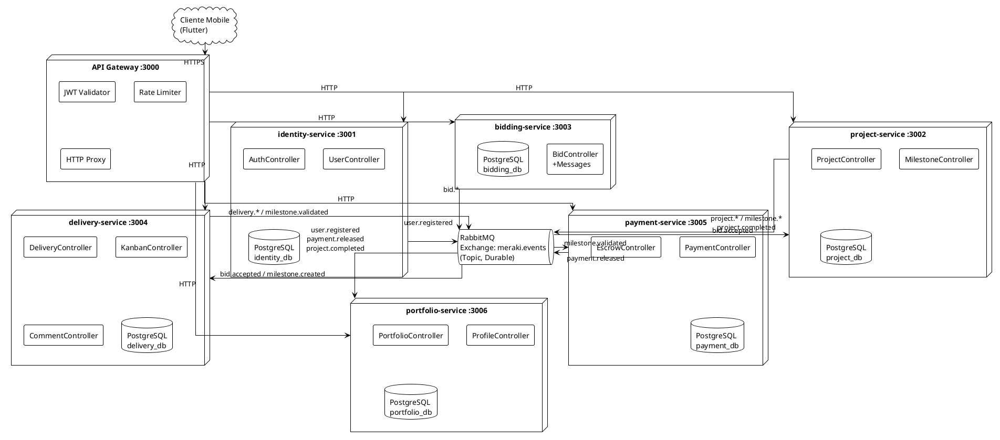
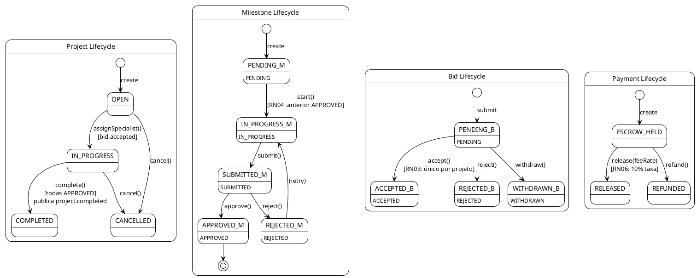

# Meraki — Diagramas UML

> Diagramas em notação PlantUML. Renderize em [plantuml.com](https://plantuml.com/plantuml) ou com extensão VS Code PlantUML.

---

## 1. Diagrama de Classes Completo

```plantuml
@startuml Meraki_Full_Class_Diagram
!theme plain
skinparam linetype ortho
skinparam classBackgroundColor #FAFAFA
skinparam classBorderColor #999
skinparam packageBackgroundColor #F0F4FF
skinparam packageBorderColor #7090D0
skinparam arrowColor #555
skinparam stereotypeCBackgroundColor #D0E8FF
skinparam stereotypeEBackgroundColor #FFE8D0
skinparam stereotypeIBackgroundColor #E8FFD0
skinparam stereotypeSBackgroundColor #FFD0E8

' ═══════════════════════════════════════
' IDENTITY & ACCESS
' ═══════════════════════════════════════
package "Identity & Access" #E8F0FF {

  enum UserType {
    COMPANY
    SPECIALIST
  }

  class Email <<ValueObject>> {
    - value: string
    + isValid(): boolean
    + equals(other: Email): boolean
    + getValue(): string
  }

  class User <<AggregateRoot>> {
    + id: UUID
    + email: Email
    - passwordHash: string
    + name: string
    + userType: UserType
    + specialistId?: UUID
    + companyId?: UUID
    + isActive: boolean
    + createdAt: Date
    + updatedAt: Date
  }

  class CompanyProfile <<Entity>> {
    + id: UUID
    + userId: UUID
    + companyName: string
    + industry?: string
    + companySize?: string
    + website?: string
    + createdAt: Date
    + updatedAt: Date
  }

  class SpecialistProfile <<Entity>> {
    + id: UUID
    + userId: UUID
    + bio?: string
    + skills: string[]
    + experience: Decimal
    + hourlyRate: Decimal
    + rating: Decimal
    + createdAt: Date
    + updatedAt: Date
  }

  User "1" *-- "0..1" CompanyProfile : companyId >
  User "1" *-- "0..1" SpecialistProfile : specialistId >
  User --> Email : uses
  User --> UserType : type
}

' ═══════════════════════════════════════
' PROJECT MANAGEMENT
' ═══════════════════════════════════════
package "Project Management" #FFF0E8 {

  enum ProjectStatus {
    OPEN
    IN_PROGRESS
    COMPLETED
    CANCELLED
  }

  enum MilestoneStatus {
    PENDING
    IN_PROGRESS
    SUBMITTED
    APPROVED
    REJECTED
  }

  class Budget <<ValueObject>> {
    - amount: Decimal
    + getValue(): Decimal
    + equals(other: Budget): boolean
    ' Invariant: amount > 0 [RN01]
  }

  class Deadline <<ValueObject>> {
    - date: Date
    + getValue(): Date
    + equals(other: Deadline): boolean
    + isBefore(date: Date): boolean
    ' Invariant: date > now [RN01]
  }

  class Project <<AggregateRoot>> {
    + id: UUID
    + title: string
    + description: string
    + requirements: string[]
    + budget: Budget
    + deadline: Deadline
    + status: ProjectStatus
    + companyId: UUID
    + specialistId?: UUID
    + bidId?: UUID
    + createdAt: Date
    + updatedAt: Date
    --
    + assignSpecialist(specialistId, bidId): void
    + complete(): void
    + cancel(): void
  }

  class Milestone <<Entity>> {
    + id: UUID
    + projectId: UUID
    + title: string
    + description: string
    + amount: Decimal
    + order: int
    + status: MilestoneStatus
    + dueDate?: Date
    + createdAt: Date
    + updatedAt: Date
    --
    + start(allMilestones: Milestone[]): void
    + submit(): void
    + approve(): void
    + reject(): void
  }

  Project "1" *-- "1..*" Milestone : contains >
  Project --> Budget : uses
  Project --> Deadline : uses
  Project --> ProjectStatus : status
  Milestone --> MilestoneStatus : status
}

' ═══════════════════════════════════════
' BIDDING
' ═══════════════════════════════════════
package "Bidding" #F0FFE8 {

  enum BidStatus {
    PENDING
    ACCEPTED
    REJECTED
    WITHDRAWN
  }

  class ProposedValue <<ValueObject>> {
    - amount: Decimal
    + getValue(): Decimal
    + equals(other: ProposedValue): boolean
    ' Invariant: amount > 0
  }

  class BidSelectionDomainService <<DomainService>> {
    + selectWinner(bidId: UUID, projectBids: Bid[]): void
    ' [RN03] Garante único vencedor por projeto
  }

  class Bid <<AggregateRoot>> {
    + id: UUID
    + projectId: UUID
    + specialistId: UUID
    + proposal: string
    + proposedBudget: ProposedValue
    + estimatedDuration: int
    + status: BidStatus
    + createdAt: Date
    + updatedAt: Date
    --
    + accept(): void
    + reject(): void
    + withdraw(): void
  }

  class BidMessage <<Entity>> {
    + id: UUID
    + bidId: UUID
    + senderId: UUID
    + message: string
    + createdAt: Date
    ' Negociação empresa <-> especialista
  }

  Bid "1" *-- "0..*" BidMessage : contains >
  Bid --> ProposedValue : uses
  Bid --> BidStatus : status
  BidSelectionDomainService ..> Bid : operates on
}

' ═══════════════════════════════════════
' DELIVERY TRACKING
' ═══════════════════════════════════════
package "Delivery Tracking" #FFF8E8 {

  enum DeliveryStatus {
    PENDING
    SUBMITTED
    APPROVED
    REJECTED
  }

  class MilestoneProgressionDomainService <<DomainService>> {
    + canStart(milestoneOrder: int, allStatuses: MilestoneStatus[]): boolean
    + assertCanStart(milestoneOrder: int, allStatuses: MilestoneStatus[]): void
    ' [RN04] Progressão sequencial de milestones
  }

  class KanbanColumnFactory <<Factory>> {
    + createDefaultColumns(projectId: UUID): KanbanColumn[]
  }

  class Delivery <<AggregateRoot>> {
    + id: UUID
    + milestoneId: UUID
    + projectId: UUID
    + specialistId: UUID
    + status: DeliveryStatus
    + deliveredFiles?: string[]
    + deliveryNotes?: string
    + rejectionReason?: string
    + submittedAt?: Date
    + reviewedAt?: Date
    + createdAt: Date
    + updatedAt: Date
  }

  class KanbanColumn <<AggregateRoot>> {
    + id: UUID
    + projectId: UUID
    + title: string
    + order: int
    + createdAt: Date
  }

  class KanbanCard <<Entity>> {
    + id: UUID
    + columnId: UUID
    + milestoneId: UUID
    + title: string
    + order: int
    + milestoneStatus?: string
    + createdAt: Date
    + updatedAt: Date
  }

  class ProjectHistory <<EventLog>> {
    + id: UUID
    + projectId: UUID
    + specialistId?: UUID
    + action: string
    + description?: string
    + createdAt: Date
    ' Read Model — sem invariantes, só auditoria [RN07]
  }

  class MilestoneComment <<Entity>> {
    + id: UUID
    + milestoneId: UUID
    + userId: UUID
    + comment: string
    + createdAt: Date
    ' Feedback empresa <-> especialista
  }

  KanbanColumn "1" *-- "0..*" KanbanCard : contains >
  Delivery --> DeliveryStatus : status
  KanbanColumnFactory ..> KanbanColumn : creates
}

' ═══════════════════════════════════════
' PAYMENT & ESCROW
' ═══════════════════════════════════════
package "Payment & Escrow" #FFE8F0 {

  enum PaymentStatus {
    ESCROW_HELD
    RELEASED
    REFUNDED
  }

  class FeeCalculationDomainService <<DomainService>> {
    + rate: number
    + calculate(amount: Decimal): FeeResult
    ' [RN06] Taxa padrão: 10%
  }

  class EscrowAccount <<AggregateRoot>> {
    + id: UUID
    + projectId: UUID
    + totalAmount: Decimal
    + heldAmount: Decimal
    + releasedAmount: Decimal
    + createdAt: Date
    + updatedAt: Date
  }

  class Payment <<AggregateRoot>> {
    + id: UUID
    + projectId: UUID
    + milestoneId: UUID
    + specialistId: UUID
    + amount: Decimal
    + specialistAmount?: Decimal
    + platformFee?: Decimal
    + status: PaymentStatus
    + escrowTransactionId?: string
    + releaseTransactionId?: string
    + releasedAt?: Date
    + createdAt: Date
    + updatedAt: Date
    --
    + release(feeRate: number): void
    ' [RN06] Calcula taxa e libera pagamento
  }

  Payment --> PaymentStatus : status
  FeeCalculationDomainService ..> Payment : used by
}

' ═══════════════════════════════════════
' PORTFOLIO
' ═══════════════════════════════════════
package "Portfolio" #F0E8FF {

  class Rating <<ValueObject>> {
    - value: Decimal
    + getValue(): Decimal
    + equals(other: Rating): boolean
    + {static} average(ratings: Rating[]): Rating
    ' Invariant: 0 <= value <= 5
  }

  class SpecialistProfileFactory <<Factory>> {
    + createFromUser(userData): SpecialistPublicProfile
  }

  class SpecialistPublicProfile <<AggregateRoot>> {
    + id: UUID
    + userId: UUID
    + name?: string
    + bio?: string
    + skills?: string[]
    + experience: Decimal
    + hourlyRate: Decimal
    + rating: Rating
    + totalProjects: int
    + completedProjects: int
    ' completedProjects++ via project.completed event
    + createdAt: Date
    + updatedAt: Date
  }

  class CompanyPublicProfile <<AggregateRoot>> {
    + id: UUID
    + userId: UUID
    + companyName?: string
    + description: string
    + website?: string
    + sector?: string
    + totalProjectsCreated: int
    + rating: Rating
    + createdAt: Date
    + updatedAt: Date
  }

  class Portfolio <<AggregateRoot>> {
    + id: UUID
    + specialistId: UUID
    + title: string
    + description: string
    + category?: string
    + images?: string[]
    + projectUrl?: string
    + technologies?: string[]
    + startDate?: Date
    + endDate?: Date
    + isPublished: boolean
    + createdAt: Date
    + updatedAt: Date
  }

  class WorkHistory <<AggregateRoot>> {
    + id: UUID
    + specialistId: UUID
    + projectId: UUID
    + projectTitle?: string
    + companyId?: UUID
    + amountEarned: Decimal
    + completedAt?: Date
    + createdAt: Date
    ' Criado via payment.released event [RF11,RF14]
  }

  class Certification <<AggregateRoot>> {
    + id: UUID
    + specialistId: UUID
    + name: string
    + issuer: string
    + issueDate?: Date
    + expiryDate?: Date
    + credentialId?: string
    + credentialUrl?: string
    + createdAt: Date
  }

  class Review <<AggregateRoot>> {
    + id: UUID
    + specialistId: UUID
    + projectId: UUID
    + reviewerId: UUID
    + rating: Rating
    + comment?: string
    + createdAt: Date
  }

  SpecialistPublicProfile --> Rating : uses
  CompanyPublicProfile --> Rating : uses
  Review --> Rating : uses
  SpecialistProfileFactory ..> SpecialistPublicProfile : creates
}

' ═══════════════════════════════════════
' CROSS-CONTEXT REFERENCES (dashed)
' ═══════════════════════════════════════
User "1" <.. "0..*" Project : companyId
User "1" <.. "0..*" Project : specialistId
User "1" <.. "0..*" Bid : specialistId
Project "1" <.. "0..*" Bid : projectId
Milestone "1" <.. "1" Delivery : milestoneId
Milestone "1" <.. "0..*" KanbanCard : milestoneId
Milestone "1" <.. "1" Payment : milestoneId
Project "1" <.. "1" EscrowAccount : projectId
User "1" <.. "0..*" WorkHistory : specialistId
User "1" <.. "1" SpecialistPublicProfile : userId
User "1" <.. "1" CompanyPublicProfile : userId
Project "1" <.. "0..*" Review : projectId

@enduml
```



---

## 2. Diagrama de Sequência — Fluxo Completo de Projeto



---

## 3. Diagrama de Componentes — Arquitetura de Microserviços



---

## 4. Diagrama de Estados



---

## 5. Rotas REST — Mapa Completo (via API Gateway)

```plantuml
@startuml Meraki_API_Routes
!theme plain
skinparam packageBackgroundColor #FAFAFA
skinparam packageBorderColor #888

package "Auth — /auth" {
  class Routes {
    POST /register
    POST /login
    GET  /me
  }
}

package "Projects — /projects" {
  class Routes2 as Routes {
    POST   /                 «COMPANY»
    GET    /
    GET    /:id
    PUT    /:id              «COMPANY»
    DELETE /:id              «COMPANY»
    PUT    /:id/complete     «COMPANY»
    POST   /:id/milestones   «COMPANY»
    GET    /:id/milestones
    GET    /:id/kanban
    GET    /:id/history
  }
}

package "Bids — /bids" {
  class Routes3 as Routes {
    POST /project/:projectId  «SPECIALIST»
    GET  /project/:projectId
    GET  /my-bids             «SPECIALIST»
    GET  /:id
    PUT  /:id/accept          «COMPANY»
    PUT  /:id/reject          «COMPANY»
    PUT  /:id/withdraw        «SPECIALIST»
    POST /:id/messages
    GET  /:id/messages
  }
}

package "Milestones — /milestones" {
  class Routes4 as Routes {
    POST /:id/submit    «SPECIALIST»
    PUT  /:id/approve   «COMPANY»
    PUT  /:id/reject    «COMPANY»
    POST /:id/comments
    GET  /:id/comments
  }
}

package "Payments — /payments" {
  class Routes5 as Routes {
    GET /project/:projectId
    GET /:id
  }
}

package "Portfolio — /portfolio & /profiles" {
  class Routes6 as Routes {
    GET  /profiles/specialist/:id
    GET  /profiles/company/:id
    POST /portfolio
    GET  /portfolio/my
    POST /certifications
    GET  /certifications/my
    POST /reviews
  }
}

@enduml
```

---

## Como renderizar

### VS Code
Instale a extensão **PlantUML** e pressione `Alt+D` em qualquer bloco `@startuml...@enduml`.

### Online
Acesse [plantuml.com/plantuml](https://www.plantuml.com/plantuml/uml/) e cole o conteúdo entre `@startuml` e `@enduml`.

### CLI
```bash
npm install -g node-plantuml
puml generate docs/UML_CLASS_DIAGRAM.md --output docs/
```
